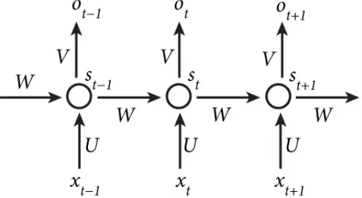
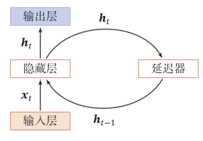
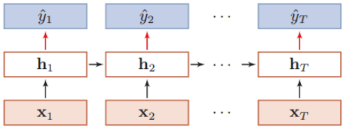

# 循环神经网络原理

循环神经网络的当前 $t$ 时间步状态受 $t-1$ 时间步状态的影响，是能处理时序数据的神经网络

$$
O_t=g(V \cdot S_t)
$$

$$
S_t=f(U \cdot X_t + W \cdot S_{t-1})
$$

循环神经网络的神经元接受其他神经元和自身两部分信息，进而形成具有环路的网络结构

# 标准循环神经网络 (RNN) 模型

## 循环神经网络介绍

循环神经网络通过使用带自反馈的神经元，能够处理任意长度的时序数据

$$
h_t=f(h_{t-1},x_t)
$$

- 循环神经网络比前馈神经网络更加符合生物神经网络的结构
- 循环神经网络已经被广泛应用在语音识别、语言模型以及自然语言生成等任务

## 循环神经网络结构

首先只有一个隐藏层的循环神经网络的结构如下所示

用公式来描述隐状态的计算过程，假设在时刻 $t$ ，网络的输入为 $x_t$ ，隐状态 (即隐藏层神经元活性值) $h_t$ 不仅和当前时刻的输入 $x_t$ 相关，也和上一个时刻的隐状态 $h_{t-1}$ 相关，进而与全部过去的输入序列 $(x_1, x_2, \dots, x_{t−1}, x_t)$ 相关

$$
z_t=Uh_{t-1}+Wx_t+b
$$

$$
h_t=f(z_t)
$$

- $z_t$ 是隐藏层的净输入
- $f(\cdot)$ 是非线性激活函数，通常为 Sigmoid 函数或 Tanh 函数
- $U$ 是状态 - 状态权重矩阵， $W$ 是状态 - 输入权重矩阵， $b$ 为偏置

## 循环神经网络的模式

| 模式                 | 特点                                                           | 应用                | 典型应用     |
| -------------------- | -------------------------------------------------------------- | ------------------- | ------------ |
| 序列到类别的模式     | 输入为序列 ( $T$ 个数据)，输出为类别 (一个数据)                | 序列数据的分类问题  | 文本分类任务 |
| 同步的序列到序列模式 | 每一时刻都有输入和输出，输入序列和输出序列的长度相同           | 序列标注任务        | 词性标注     |
| 异步的序列到序列模式 | 输入序列和输出序列不需要有严格的对应关系，也不用保持相同的长度 | 编码器 - 解码器模型 | 机器翻译     |

### 1. 序列到类别的模式

假设有一个样本 $x_{1:T} = (x_1, x_2, \dots, x_T)$  为一个长度为 $T$ 的序列，输出为一个类别 $y \in \set{1, 2, \dots, C}$ 。将样本 $x$ 按不同的时刻输入到循环神经网络中去，可得到不同时刻的隐状态 $h_1, h_2, \dots, h_T$ ，然后将 $h_T$ 看做整个序列的最终表示，输入给分类器 $g(\cdot)$ 做分类

$$
\hat{y}=g(h_T)
$$

还可以对整个序列的所有状态进行平均，用平均隐状态来作为整个序列的表示

$$
\hat{y}=g(\frac{1}{T} \sum_{t=1}^{T} h_t)
$$

### 2. 同步的序列到序列模式

假设有一个样本 $x_{1:T} = (x_1, x_2, \dots, x_T)$  为一个长度为 $T$ 的序列，输出为一个类别 $y_{1:T} = (y_1, y_2, \dots, y_T)$ 。将样本 $x$ 按不同的时刻输入到循环神经网络中去，可得到不同时刻的隐状态 $h_1, h_2, \dots, h_T$ ，然后把每个时刻的隐状态输入给分类器 $g(\cdot)$ ，得到当前时刻的标签

$$
\hat{y_t}=g(h_t), \quad \forall t \in [1,T]
$$

### 3. 异步的序列到序列模式

在异步的序列到序列模式中，输入为一个长度为 $T$ 的序列 $x_{1:T} = (x_1, x_2, \dots, x_T)$
输出一个长度为 $M$ 的序列 $y_{1:M} = (y_1, y_2, \dots, y_M)$

先将样本 $x$ 按不同时刻输入到一个循环神经网络 (编码器) 中，得到其编码 $h_t$ ，然后在另一个循环神经网络 (解码器) 中得到输出序列 $\hat{y}_{1:M}$ 。为了建立输出序列之间的依赖关系，在解码器中通常使用非线性的自回归模型

$$
h_t = f_1(h_{t-1}, x_t), \quad \forall t \in [1, T]
$$

$$
h_{T+t} = f_2(h_{T+t-1}, \hat{y}_{t-1}), \quad \forall t \in [1, M]
$$

$$
\hat{y}_t = g(h_{T+t}), \quad \forall t \in [1, M]
$$

其中 $f_1(\cdot)$ 和 $f_2(\cdot)$ 分别表示用作编码器和解码器的循环神经网络， $g(\cdot)$ 为分类器

# 长短时记忆网络 (LSTM) 模型

## LSTM 与传统 RNN 的区别

标准 RNN 只有两个主要操作: 将先前的隐藏状态与新输入组合并将其传递给激活函数

LSTM 的控制流程与 RNN 相似，它们都是在前向传播的过程中处理流经的数据，不同之处在于 LSTM 中细胞的结构和运算有所变化

## LSTM 门控制机制

LSTM 具有删除或添加信息到细胞状态的能力，这个能力是由被称为门 (Gate) 的结构所赋予的。为了控制记忆元，我们需要许多门

门 (Gate) 是一种可选地让信息通过的方式。它由一个 Sigmoid 神经网络层和一个点乘法运算组成

Sigmoid 神经网络层输出 0 和 1 之间的数字，这个数字描述每个组件有多少信息可以通过，0 表示不通过任何信息，1 表示全部通过

```mermaid
graph BT;
    I("`Input Gate <br/> 是否值输入`") --> M("`Memory Cell <br/> 将值储存`") --> O("`Output Gate <br/> 是否值输出`")
    F("`Forget Gate <br/> 是否将值清除`") --> M
```

| 门                 | 作用                                                                                 | 行为                                                                                                          |
| ------------------ | ------------------------------------------------------------------------------------ | ------------------------------------------------------------------------------------------------------------- |
| Input Gate 输入门  | 决定当前时间步长输入信息的哪些部分需要被更新到当前时间步长的状态信息中               | “输入门层”的 Sigmoid 层决定了我们将更新哪些值   一个 tanh 层创建候选向量 Ct，该向量将会被加到细胞的状态中 |
| Memory Cell 记忆元 | 隐藏层输出包括“隐状态”和“记忆元”。只有隐状态会传递到输出层，而记忆元完全属于内部信息 |                                                                                                               |
| Output Gate 输出门 | 决定了我们要输出的细胞状态的哪些部分                                                 | 单元格状态通过 tanh (将值规范化到 -1 和 1 之间)，并将其乘以 Sigmoid 门的输出                                  |
| Forget Gate 遗忘门 | 决定我们要从细胞状态中丢弃什么信息                                                   | 查看前一个输出和当前输入，并为单元格状态 (上一个状态) 中的每个数字输出 0 和 1 之间的数字                      |

# 循环神经网络的应用
