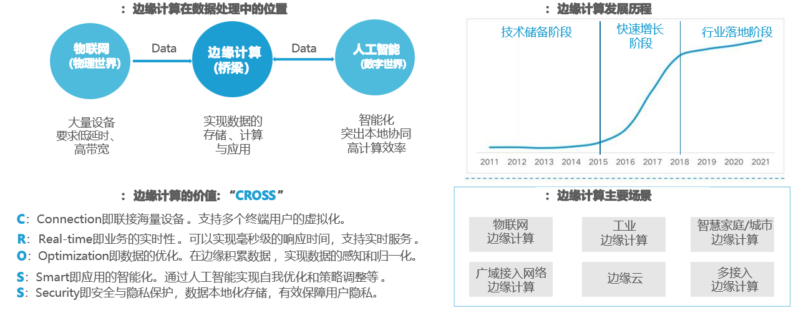
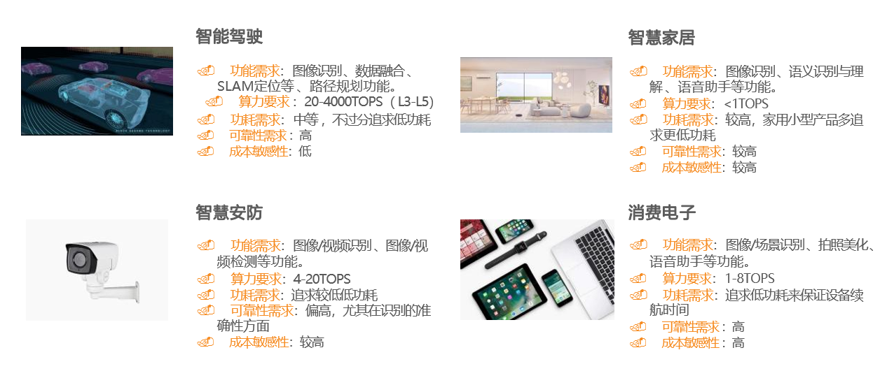

# 前言

- **政策扶持**和**市场需求**是人工智能芯片发展的核心驱动力
- 四大人工智能芯片
  - GPU
  - ASIC
  - FPGA
  - 类脑芯片
- 中国人工智能芯片挑战与机遇并存
  - 技术：**基础理论**，**关键设备落后**，，因此**芯片制造**环节仍有所差距，但垂直行业应用的**芯片设计**及相关**企业的数量**上，中国仍占据较为优势的地位
  - 算法：创新计算范式，政策解决“信息孤岛”
  - 应用：消费电子，自动驾驶，智能安防，机器人；政策指导使产业获得更好的**联动性**
- 总结：**产学研融合**不失为一种有效的途径；维持人工智能芯片的**可持续发展**

# 人工智能芯片行业发展现状

## 研究主题界定

- “无芯片不 AI”, 以 AI 芯片为载体实现的算力是人工智能发展水平的重要衡量标准
- 广义的 AI 芯片：专门用于处理人工智能应用中大量计算任务的模块，即面向人工智能领域的芯片均被称为 AI 芯片
- 狭义的 AI 芯片：针对人工智能算法做了特殊加速设计的芯片
- 针对狭义的 AI 芯片即人工智能算法做特殊加速设计的四种主流芯片 GPU、ASIC、FPGA、类脑芯片以及系统级 AI 芯片技术、实现 AI 的主流算法及在场景中的应用情况进行解析

## AI 芯片发展历程

- AI 芯片的发展主要依赖两个领域：第一个是模仿人脑建立的**数学模型与算法**，第二个是**半导体集成电路**即芯片
- 人工智能于芯片的发展分为三个阶段：第一阶段由于芯片算力不足，神经网络算法未能落地；第二阶段芯片算力提升，但仍无法满足神经网络算法需求；第三阶段，GPU 和新架构的 AI 芯片促进了人工智能的落地
- 目前，随着第三代神经网络的出现，弥合了神经科学与机器学习之间的壁垒，AI 芯片正在向**更接近人脑的方向**发展

## 中国政策环境

聚焦**高端芯片**等关键领域

## 中国市场环境

目前，中国人工智能产业链中，应用层企业比例超过 80%，结合场景的**应用落地**是人工智能产业的主要驱动力

计算机视觉、机器人、自然语言处理、机器学习、生物识别占比居前五

## 中国人工智能芯片人才市场：各领域人才缺口仍较大，国家开始重视人才培养

- AI 芯片的实现包含**软件**和**硬件**两个方面
- 目前，仍有部分企业在人才招聘中遇到不少阻碍，**人才缺乏**、**成本高**是主要的问题
- 在 2018-2021 年，超过 300 所高校开设了人工智能专业；部分企业也开始与高校进行合作，以**产学研合作**教学模式共同培养综合能力突出的优质人才

# 人工智能芯片解读

## 技术层面

### 基于技术架构、部署位置及实践目标的 AI 芯片分类

- AI 芯片一般泛指所有用来加速 AI 应用，尤其是用在基于神经网络的深度学习中的硬件
- AI 芯片根据其技术架构，可分为 GPU、FPGA、ASIC 及类脑芯片，同时 CPU 可执行通用 AI 计算，其中类脑芯片还处于探索阶段
- AI 芯片根据其在网络中的位置可以分为**云端 AI 芯片**、**边缘及终端 AI 芯片**；根据其在实践中的目标，可分为**训练（training）芯片**和**推理（inference）芯片**
- 云端主要部署训练芯片和推理芯片，承担训练和推理任务，具体指智能数据分析、模型训练任务和部分对传输带宽要求比高的推理任务；边缘 和终端主要部署推理芯片，承担推理任务，需要独立完成数据收集、环境感知、人机交互及部分推理决策控制任务

| 技术架构种类               | 定制化程度 | 可编辑性 | 算力 | 价格 | 优点                                                                                   | 缺点                                           | 应用场景                                                     |
| -------------------------- | ---------- | -------- | ---- | ---- | -------------------------------------------------------------------------------------- | ---------------------------------------------- | ------------------------------------------------------------ |
| GPU                        | 通用型     | 不可编辑 | 中   | 高   | 通用性较强且适合大规模并行运算；设计和制造工艺成熟                                     | 并行运算能力在推理端无法完全发挥               | 高级复杂算法和通用性人工智能平台                             |
| FPGA                       | 半定制化   | 容易编辑 | 高   | 中   | 可通过编程灵活配置芯片架构适应算法迭代，平均性能较高；功耗较低；开发时间较短（6 个月） | 量产单价高；峰值计算能力较低；硬件编程困难     | 适用于各种具体的行业                                         |
| ASIC                       | 全定制化   | 难以编辑 | 高   | 低   | 通过算法固化实现极致的性能和能效、平均性能很强；功耗很低；体积小；量产后成本最低       | 前期投入成本高；研发时间长（1 年）；技术风险大 | 当客户处在某个特殊场景，可以为其独立设计一套专业智能算法软件 |
| 类脑芯片（不同的技术路线） | 模拟人脑   | 不可编辑 | 高   | -    | 最低功耗；通信效率高；认知能力强                                                       | 目前仍处于探索阶段                             | 适用于各种具体的行业                                         |

### GPU

- GPU(Graphics Processing Unit) 图形处理器最初是一种专门用于图像处理的微处理器，随着图像处理需求的不断提升，其图像处理能力也得 到迅速提升。目前，GPU 主要采用数据并行计算模式完成顶点渲染、像素渲染、几何渲染、物理计算和通用计算等任务。因其超过 CPU 数十倍 的计算能力，已成为通用计算机和超级计算机的主要处理器。其中通用图形处理器 GPGPU(General Propose Computing on GPU) 常用于数据 密集的科学与工程计算中
- 英伟达与 AMD 仍占据 GPU 霸主地位，2018 年至今，国产 GPU 也积极发展中，已有部分产品落地

### ASIC 和 FPGA

ASIC 与 FPGA 的特点：

- FPGA 全称是 Field Programmable Gate Array：可编程逻辑门阵列，是一种“可重构”芯片，具有模块化和规则化的架构，主要包含可编程逻辑模块、片上储存器及用于连接逻辑模块的克重购互连层次结构。在较低的功耗下达到 GFLOPS 数量级的算力使之成为并行实现人工神经网络的替代方案
- ASIC（Application-Specific Integrated Circuit）是指应特定用户要求和特定电子系统的需要而设计、制造的集成电路。ASIC 从**性能、能效、成本**均极大的超越了标准芯片，非常适合 AI 计算场景，是当前大部分 AI 初创公司开发的目标产品

ASIC 与 FPGA 的市场：

- FPGA 具有开发周期短，上市速度快，可配置性等特点，目前被大量的应用在大型企业的**线上数据处理中心和军工单位**。ASIC 一次性成本远远 高于 FPGA，但由于其量产成本低，应用上就偏向于**消费电子**，如移动终端等领域
- 目前，处理器中开始集成 FPGA，也出现了可编程的 ASIC，同时，随着 SoC 的发展，两者也在互相融合

### Soc

- 在手机、可穿戴设备等端设备中，很少有独立的芯片，AI 加速将由 SoC 上的一个 IP 实现
- SoC(System-on-chip，片上系统) 作为 ASIC 设计方法学中的新技术，始于 20 世纪 90 年代中期，是以嵌入式系统为核心，以 IP 复用技术为基础，集软、硬件于一体的集成芯片。在一个芯片上实现信号的传输、存储、处理和 I/O 等功能，包含嵌入软件及整个系统的全部内容
- 由于高集成效能，SoC 已经成为微电子芯片发展的必然趋势

### 类脑芯片

不考

### AI 新派你发展

- 现在用于深度学习的 AI 芯片（包括 CPU、GPU、FPGA、ASIC）为了实现深度学习的庞大乘积累加运算和并行计算的高性能，芯片面积越做越 大，带来了成本和散热等问题。AI 芯片软件编程的成熟度、芯片的安全，神经网络的稳定性等问题也未能得到很好的解决，因此，在现有基础上进行改进和完善此类 AI 芯片仍是当前主要的研究方向
- 最终，AI 芯片将近一步提高智能，向着更接近人脑的高度智能方向不断发展，并向着边缘逐步移动以获得更低的能耗
- AI 硬件加速技术已经逐渐走向成熟。未来可能更多的创新会来自电路和器件级技术的结合，比如存内计算，类脑计算；或者是针对特殊的计 算模式或者新模型，比如稀疏化计算和近似计算，对图网络的加速；或者是针对数据而不是模型的特征来优化架构
- 同时，如果算法不发生大的变化，按照现在 AI 加速的主要方法和半导体技术发展的趋势，或将在不远的将来达到数字电路的极限（约 1 到 10TFlops/W），往后则要靠近似计算，模拟计算，甚至是材料或基础研究上的创新

#### 存内计算

核心问题：传统冯诺伊曼架构中，计算与内存是分离的单元，内存主要使用的 DRAM 方案性能提升速度远远慢 于处理器速度，造成了阻碍性能提升的“内存墙”，直接在存储内做计算可有效解决

实现方法：

1. 改动存储模块电路：优势是容易和现有工艺进行集成，缺点是带来的性能提升有限；
2. 引入新的存储器件，实现在存储阵列内完成计算

#### 模拟计算

核心问题：传统模拟架构通过模数/数模转换器将模拟信号与数字表示形式进行相互转换，带来信号损耗、功率消耗和时延
实现方法：在 AI 芯片中使用模拟计算技术，将深度学习算法运算放在模拟域内完成，提高能效

#### 量子计算

核心问题：AI 计算对大算力的需求
实现方法：完全新型的计算模式，理论模型为图灵机。从计算效率上，由于量子力学叠加性，配合量子力学演化的并行性，处理速度远超传统计算机，提供更强算力

## 应用层面

### 云端：当前仍是 AI 的中心，需更高性能计算芯片以满足市场需求

- 当前，大多数 AI 训练和推理工作负载都发生在公共云和私有云中，云仍是 AI 的中心。在对隐私、网络安全和低延迟的需求推动下，云端出现了在网关、设备和传感器上执行 AI 训练和推理工作负载的现象，更高性能的计算芯片及新的 AI 学习架构将是解决这些问题的关键。
- 互联网是云端算力需求较旺盛产业，因此除传统芯片企业、芯片设计企业等参与者外，互联网公司纷纷入局 AI 芯片产业，投资或自研云端 AI 芯片

### 边缘侧：数据向边缘下沉，随着行业落地市场将有很大增量

- 5G 与物联网的发展以及各行业的智能化转型升级，带来了爆发式的数据增长。海量的数据将在边缘侧积累，建立在边缘的数据分析与处理将大幅度的提高效率、降低成本
- 随着大量的数据向边缘下沉，边缘计算将有更大的发展，IDC 预测，未来，超过 50% 的数据需要在边缘侧进行储存、分析和计算，这就对边缘侧的算力提出了更高的要求。芯片作为实现计算能力的重要基础硬件，也将具备更多的发展。ABI Research 预测，2025 年，边缘 AI 芯片市场将超过云端 AI 芯片
- 在人工智能算法的驱动下，边缘 AI 芯不但可以自主进行逻辑分析与计算，而且可以动态实时地自我优化，调整策略，典型的应用如黑灯工厂等

边缘计算的价值 "CROSS"：

### 终端侧：终端产品类型逐渐多样，出货量增加催生大量芯片需求

- 根据亿欧数据测算，中国自动驾驶行业规模增速在 2022 年将达到 24% ；智能摄像头产品出货量增速超 15% ；手机、平板、VR/AR 眼镜等智能 产品出货量也均有较大增速，催生出大量的智能芯片需求。
- 同时，智能终端产品种类也逐渐多样，智能音响、服务/商用机器人等消费硬件、工业/数控设备等工业产品以及通信产品等日渐丰富，不同产 品类型也对芯片性能与成本提出更多的要求。

