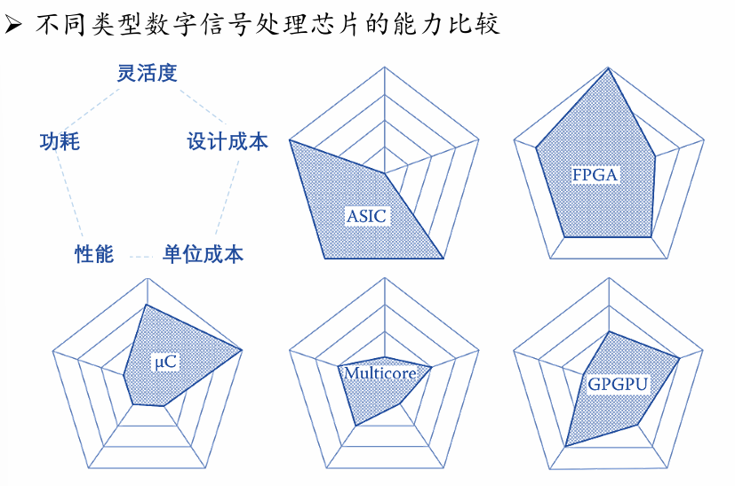
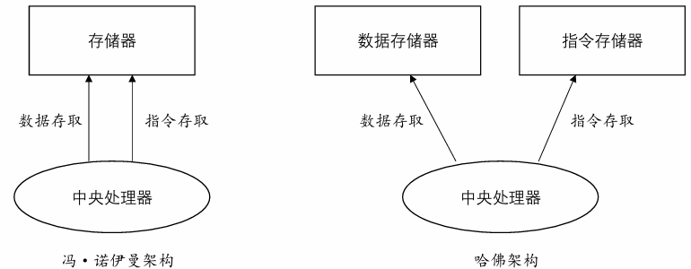
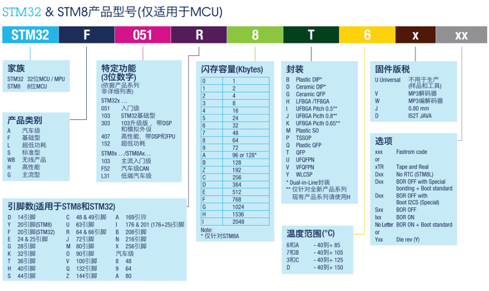

# 嵌入式系统及其应用

## 嵌入式系统概述

首先依据电子计算机的发展：以高性能、智能化方向发展为主

但随着微电子技术、通信技术、感知测量技术的发展，设计目标发生变化
- 高性能 -> 用户需求和资源约束的平衡
- (计算速度、内存) -> (体积、损耗、功能)

## 什么是嵌入式？

嵌入式系统是以应用为中心，以现代计算机技术为基础，能够根据用户需求灵活裁剪软硬件模块的专用计算机系统

### 特点

- 一般是实时操作系统
- 需要高可靠性保障
- 有功耗约束
- 涉及多个领域，嵌入式系统无法独立使用，须与一个应用领域结合

### 例子

- 智能手环
  - STM32L
  - ARM Cortex-M3
- 大疆无人机
  - STM32L
  - ARM Cortex-M4
- 数字微流控

## 嵌入式系统的层次

## 常用模块分类

| 类别 | 基础模块                                        | 扩展模块                                                                             |
| ---- | ----------------------------------------------- | ------------------------------------------------------------------------------------ |
| 硬件 | 微控制器单元(MCU), 电源和能量供给模块, 复位模块 | 传感器、传感器信号处理转换电路、存储器模块、通信模块、看门狗模块、加密模块、执行器等 |
| 软件 | 各种硬件模块的驱动程序，嵌入式操作系统内核      | 信号处理程序库，加密解密，压缩解压缩，控制算法，安全算法，通信协议                   |

- MCU 微处理器 (单片机)
  - 将内存、计数器、USB、 A/D 转换融合等整合在单一芯片上
- FPGA (现场可编辑门阵列)
  - PAL (可编程阵列逻辑) + GAL (通用阵列逻辑) 等可编程器件进一步发展的产物
  - 对专用集成电路ASIC半定制电路而出现的
  - 通过硬件描述语言开发，任何数字器件的功能，包括CPU
  - 基本组成
    - 逻辑功能块
    - 输入输出块
    - 布线资源
  - 扩展模块
    - 存储器资源
    - 数字时钟管理单元
    - 算术运算单元

- SOC (系统级芯片)
  - OC 定义为将微处理器、模拟 IP 核、数字 IP 核和存储器 (或片外存储控制接口) 集成在单一芯片上，面向特定用途的标准产品
  - 半导体先进封装硅通孔 (TSV) 工艺，变为 SoIC 或 Chiplet 技术

# 计算的基本原理和历史演变

## 计算机的概念

数值计算、通用信息处理和智能计算

## 图灵机理论模型

图灵机可解决任何计算问题 (结构)
- 无限长的纸带
- 一个读写头
- 一个状态寄存器
- 一套控制规则

### 意义

- 回答了计算的能力范围 (有限步数内给出答案)
- 符合图灵机原理的不同技术实现在理论上具有相同的计算能力
- 在理论上规范了计算机的实现思路

# 计算机架构的发展

## 冯诺依曼架构

规范化计算机组织结构，包括五部分
- 存储器
- 运算器
- 控制器
- 输入设备
- 输出设备

改进部分后
- 从最开始的运算器为核心改为了存储器为核心
  - 运算器数据吞吐能力有限，成为整个系统的瓶颈
- 内存储器存放正在运行的程序代码和数据，大容量外存储器存放脱机断电期数据

## 哈佛架构

- 区分指令存储器和数据存储器，设置指令总线和数据总线
- 为降低成本和复杂度需要，分区存储器

计算机系统结构的改进，受现有技术水平和工艺条件的约束

常用的系统结构技术
- 流水线技术
- 并行处理
- 硬件加速
- 指令预取和推断执行
- 层次设计和缓存
- 总线和交换式部件互联
- 虚拟化技术
- 寄存器窗口
- 实时技术

# 嵌入式系统的发展

嵌入式系统伴随集成电路、微处理器等技术共同发展

## 集成电路发展简史

| 年代              | 事件                                   |
| ----------------- | -------------------------------------- |
| 20世纪 30-50 年代 | 计算机诞生，并逐渐统一到冯诺依曼架构下 |
| 1958年            | TI 公司发明第一块 IC 芯片              |
| 1961年            | TI 推出第一个基于 IC 的计算机          |
| 1965年            | Moore 定律和中国的第一块 IC 诞生       |
| 1968年            | Intel 公司诞生，并开发第一块 1kb RAM   |
| 1971年            | Intel 推出 4004，第一款广泛应用的 CPU  |
| 1981年            | Intel 推出 8 位控制器 8051             |
| 1987年            | Acorn 推出 ARM1 处理器                 |
| 1990年            | ARM 公司成立，并推出 ARM6,7 内核       |
| 2004年            | STM32F 系列芯片推出                    |

### 补充说明

- 1987 年，TSMC 成立，第一家提供专业积体电路制造服务
- 1990 年，ARM 公司成立，并推出 ARM6,7 内核
- 2004 年，STM32F 系列芯片推出

商业模式的创新极大加速嵌入式系统的发展
- IP (知识产权) 商业模式
- Fabless (无晶圆厂) 模式

# ARM, Cortex 与 STM32 简介

指令集体系结构 (Instruction Set Architecture, ISA)
- 定义了一台计算机可以执行的所有指令的集合
- 定义处理器上的软件如何构建

指令集架构 (ISA) 是计算机体系结构中非常重要的一个部分，它规定了处理器可以执行哪些指令以及这些指令的格式。ISA 可以分为两大类：复杂指令集 (CISC) 和精简指令集 (RISC)

### CISC (Complex Instruction Set Computer)

典型的代表是 X86 指令集，广泛应用于个人电脑和服务器

### RISC (Reduced Instruction Set Computer)

- ARM 指令集：广泛应用于移动设备、嵌入式系统等
- MIPS 指令集：常用于路由器、游戏机等
- RISC-V 指令集：一种开源的 RISC 指令集架构，近年来发展迅速

## RISC 技术与 CISC 技术比较

| 指标       | CISC                                                             | RISC                                                                 |
| ---------- | ---------------------------------------------------------------- | -------------------------------------------------------------------- |
| 价格       | 硬件结构复杂，**芯片成本高**                                     | 硬件结构简单，**芯片成本低**                                         |
| 流水线     | 减少代码尺寸，增加指令的执行周期数，注重硬件执行指令的功能性     | 使用流水线降低指令的执行周期数，增加代码密度                         |
| 指令集     | **指令长度不固定**，大量的汇杂类型指令集，有专用指令完成特殊功能 | **指令长度固定**，简单的单周期指令，常用的功能由多个简单指令组合完成 |
| 功能与体积 | 含有丰富的电路单元，功能强，**体积大，功耗大**                   | 处理器结构简单，**体积小，功耗小**                                   |
| 设计周期   | 长                                                               | 短                                                                   |
| 应用范围   | 通用桌面机、高性能计算机                                         | 嵌入式领域、移动设备                                                 |

## ARM体系结构

计算机的体系结构 (Computer Architecture)，是指计算机的逻辑结构与功能特性
- 体系结构主要包括微处理器所支持的指令集和基于该体系结构下微处理器的编程模型
- 体系结构的关键是指此微处理器提供的指令系统和寄存器组

## Cortex系列架构属于ARMv7内核

- Cortex 系列处理器
  - Cortex-A：应用程序类型，虚拟内存系统架构，适用于高消耗电子领域
  - Cortex-R：实时型，针对高性能高实时的应用
  - Cortex-M：微控制器类型，适合低功耗、高性能且成本敏感的产品，主要面向嵌入式及工业控制领域
    - Cortex-M3
    - Cortex-M4
    - Cortex-M7

## STM32

意法半导体 (STMicroelectronics) 是较早在市场上推出基 Cortex 内核的微处理器产品的公司。

- STM32 芯片是已经封装好的成品，主要由内核和片上外设组成。若与电脑类比，内核与外设就如同电脑上的 CPU 与主板、内存、显卡、硬盘的关系
  - 内核 (Cortex—M3)：ARM设计
  - 外设 (通过总线矩阵连接 FLASH 、SRAM、和外设)：ST 设计

## 半导体芯片常见的封装方式

- DIP ((Plastic) Dual In-line Package)： (塑料) 双列直插式封装
- SOP (Small Outline Package)：小外型表面贴片封装
- PQFP (Plastic Quad Flat Package)：塑料方形扁平封装
- LQFP (Low-profile Quad Flat Package): 薄型QFP指封装
- QFN (Quad Flat No-leads package)： (塑料) 无引脚封装
- PLCC (Plastic J-Leaded Chip Carrie): 塑封方形引脚插入式封装
- BGA (Ball Grid Array): (塑料) 球栅阵列封装
- PGA (Pin Grid Array Packagev):插针网格阵列封装

# 开源架构与国产嵌入式芯片

RISC-V (精简指令集计算机)

加州大学研发，架构简单，仅 47 条基础指令，用户可在这一基础上进行扩展

其余了解就够了 (国产的华大半导体等没有知识点)

# 嵌入式系统工程设计与开发

课程要求：需求分析、系统设计、系统开发、系统测试、 系统交付

嵌入式系统的开发
- 系统总体开发
- 嵌入式软硬件开发
- 系统测试

细分
- 系统需求分析
- 系统总体设计
- 系统硬件设计
- 系统软件设计
- 系统软硬件测试
