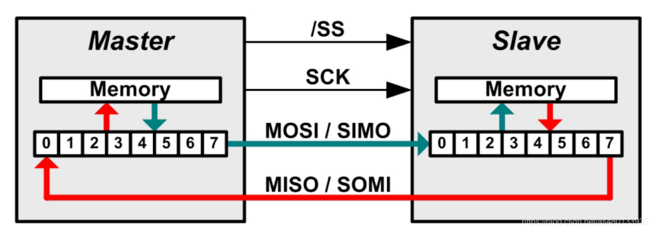

# SPI 协议基本概念

特点
- 高速的，全双工，同步的通信总线
- 在芯片的管脚上只占用四根线
- 主要应用：EEPROM、FLASH、实时时钟、AD/DA 转换器、数字信号处理器和数字信号解码器等

> [!NOTE]
> SPI: 串行外围设备接口

## SPI 主从模式

- SPI 分为**主、从**两种模式，一个 SPI 通讯系统需要包含一个且只能是一个主设备，一个或多个从设备
- 提供时钟的为主设备 (Master) ，接收时钟的设备为从设备 (Slave)
- SPI 接口的读写操作，都是由主设备发起
- 当存在多个从设备时，通过各自的**片选信号**进行管理
- SPI 是**全双工**且 SPI **没有定义速度限制**，一般的实现通常能达到甚至超过 10 Mbps

> [!NOTE]
> 片选，很多芯片挂在同一总线上的时候，有一个信号来区别总线上的数据和地址由哪个芯片来处理，这个信号就叫做片选信号 CS (chip select)

## SPI 信号线

- MISO：主设备输入/从设备输出引脚。该引脚在从模式下发送数据，在主模式下接收数据
- MOSI：主设备输出/从设备输入引脚。该引脚在主模式下发送数据，在从模式下接收数据
- SCLK：串行时钟信号，由主设备产生
- CS/SS：从设备片选信号，由主设备控制。让主设备可以单独地与特定从设备通讯，避免数据线上的冲突

## SPI 设备选择

SPI 是**单主设备通信协议**，当 SPI 主设备想读/写从设备时，它首先拉低从设备对应的 SS 线 (SS 是低电平有效) ，接着开始发送工作脉冲到时钟线上，在相应的脉冲时间上，主设备把信号发到 MOSI 实现“写”，同时可对 MISO 采样而实现“读”

## SPI 数据收发接送

- SPI 主机和从机都有一个**串行移位寄存器**，主机通过向它的 SPI 串行寄存器写入一个字节来发起一次传输
- 主机将要发送的数据写到**发送数据缓存区**，缓存区经过移位寄存器 (0~7)，串行移位寄存器通过 MOSI 信号线将字节一位一位的移出去传送给从机
- MISO 接口接收到的数据经过移位寄存器一位一位的移到**接收缓存区**。从机也将自己的串行移位寄存器 (0~7) 中的内容通过 MISO 信号线返回给主机。同时通过 MOSI 信号线接收主机发送的数据，两个移位寄存器中的内容就被交换

总结：数据接送时，都是先到相应数据缓存区，通过移位寄存器到 MOSI/MISO，到达对端机器

# SPI 通信时序的四种配置

通信双方必须是工作在同一模式下，通常可以对主设备的模式进行配置，通过 CPOL (时钟极性) 和 CPHA (时钟相位) 来定义主设备的通信模式

| SPI 模式 | CPOL | CPHA | 无效 SCK 时钟 | 采样时刻 (读) | 发送数据 (写) |
| -------- | ---- | ---- | ------------- | ------------- | ------------- |
| 0        | 0    | 0    | 低电平        | 第一个边沿    | 第二个边沿    |
| 1        | 0    | 1    | 低电平        | 第二个边沿    | 第一个边沿    |
| 2        | 1    | 0    | 高电平        | 第一个边沿    | 第二个边沿    |
| 3        | 1    | 1    | 高电平        | 第二个边沿    | 第一个边沿    |

- CPOL
  - 0: 高电平有效
  - 1: 低电平有效
- CPHA
  - 0: 时钟信号第一个边沿采样，第二个边沿发送数据
  - 1: 时钟信号第二个边沿采样，第一个边沿发送数据
