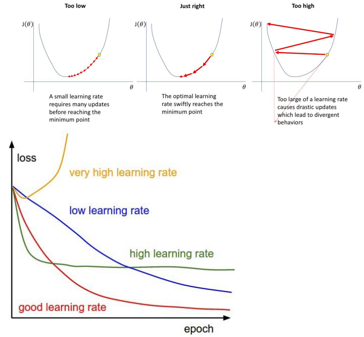

# 传统的环境感知技术

## 基于传统环境感知技术的激光雷达路缘石检测

- [获取原始点云并将处于选定区域内的点按类划分成若干点集](#获取原始点云并将处于选定区域内的点按类划分成若干点集)
- [将按类划分好的每个点集进一步划分为左、右两个子点集](#将按类划分好的每个点集进一步划分为左右两个子点集)
- [将得到的左、右子点集按一定顺序进行排序](#将得到的左右子点集按一定顺序进行排序)
- [从排好序的子点集中提取出左、右路缘石点集](#从排好序的子点集中提取出左右路缘石点集)
- [利用左、右路缘石点集拟合出左、右路缘石线段](#利用左右路缘石点集拟合出左右路缘石线段)

### 获取原始点云并将处于选定区域内的点按类划分成若干点集

- 订阅 velodyne_points 消息获取原始点云并切割出处于**感兴趣区域**内的部分
- 将处于感兴趣区域内的点云按其所属射线**划分成若干个点集**
- 激光射线投射在不同高度的路缘石平台与路面上导致了**弧线错位**现象

### 将按类划分好的每个点集进一步划分为左、右两个子点集

- 按 x 轴划分点集
  - 简单直观, 车体发生偏转时, 容易产生错误划分
- 按参考线划分点集
  - 得到的参考点几乎总是处于路面上, 减少了左右点集划分错误的情况
  - 通过高度信息筛选, 获得**最远点**集中投射在路面上的点
  - 对最远点集中投射在路面点的坐标进行求和取平均, 获得**参考点**坐标
  - 将参考点与雷达中心进行连线得到参考线对所有点集进行左右划分, 得到**左、右子点集**

### 将得到的左、右子点集按一定顺序进行排序

- 使用**顺时针**与**逆时针**的方式分别对右子点集与左子点集中的点进行排序

### 从排好序的子点集中提取出左、右路缘石点集

- 路缘石与路面存在一定高度差, 可利用激光雷达**投射在路缘石垂面上相邻两点高度之差较大**这一几何特性获取包含路缘石点的有效窗口, 并选定有效窗口中与邻点高度差最大一点为路缘石点
- 使用**滑动窗口方法**对排序后的左右子点集进行筛查, 提取路缘石点

### 利用左、右路缘石点集拟合出左、右路缘石线段

- 对每个路缘石点进行两两连线, 将得到的所有直线**按斜率进行聚类**
- 对聚类结果中最大类内的直线取平均, 即得到拟合的路缘石线

## 基于传统环境感知技术的摄像机车道线检测

- [提取车道线](#提取车道线)
- [拟合车道线](#拟合车道线)
- [坐标系变换](#坐标系变换)

### 提取车道线

实际平行的车道线在图像上呈现出近宽远窄的效果。尽量去除图像中车道线之外的部分, 只保留感兴趣区域

- 中值滤波
  - 将图像中的每一个像素点用附近邻域内所有像素点的中值来代替, 从而去除图像中的一些噪声
- 颜色空间转换
  - 将鸟瞰图由 RGB 颜色空间转换为 HSV 颜色空间, 以便于提取图像中的车道线像素点
- 车道线颜色提取
  - 结合车道线的实际颜色——黄色, 在 HSV 空间下给定颜色阈值的范围, 提取车道线颜色, 得到对应的黑白二值图, 像素值只包含 0 (黑色) 和 255 (白色)
- 形态学处理
  - 定义结构元素 (核), 用于与图像卷积, 实现对图像的腐蚀膨胀操作
  - 对提取车道线颜色后得到的黑白二值图进行腐蚀操作, 对其进一步减噪
    - 腐蚀就是求局部最小值的操作, 核 B 与图像 (或图像的一部分区域, 我们称之为 A) 卷积, 即计算核 B 覆盖区域的像素点最小值, 并把这个最小值赋值给参考点指定的像素。这样就会使图像中的高亮区域逐渐减少
  - 对腐蚀后的黑白二值图进行膨胀操作, 以对腐蚀后得到的结果进行增强 (膨胀和腐蚀是相反的一对操作, 所以膨胀就是求局部最大值的操作)

### 拟合车道线

- 计算车道线下端起点
  - 以图像的左上顶点为坐标原点, 以图像高为 x 轴、宽为 y 轴建立的平面直角坐标系, 将图像分为左右两部分, 对这两部分沿 x 轴方向将像素值累加, 分别找出两部分中最大的累加值, 将其所在位置作为左右车道线的下端起点
- 滑动窗口
  - 以车道线的下端起点作为第一个窗口的中点, 按预先设定的窗口大小确定第一个窗口, 返回窗口内所有非零像素点的坐标值, 将所有非零像素点坐标的平均值作为第二个窗口的中点生成第二个窗口以此类推
  - 利用滑动窗口能够排除二值图中车道线以外的杂点并返回图像中车道线对应的所有非零像素点的坐标, 用于车道线的直线拟合
- 车道线拟合
  - 利用 numpy 库中的多项式拟合函数 polyfit 对滑窗返回的有效车道线坐标值进行直线拟合, 函数返回值是拟合的直线方程系数

### 坐标系变换

- 像素坐标系转换至车体坐标系
  - 将拟合出的车道线投影到现实世界三维空间中, 并显示在 rviz 界面上
  - 两次坐标系变换: 利用拟合好的直线方程系数对坐标系进行变换, 先转换至世界坐标系, 再转换至车体坐标系

# 机器学习和神经网络基础

## 机器学习概述

### 机器学习的基本分类

- 监督学习
- 无监督学习
- 强化学习

### 什么是经验风险最小化

### 损失函数

通过算法学得的函数 $f(x)$ 的输出和 $x$ 样本对应的真实值 $y$ 之间的距离这个损失越小, 表示学得的函数 $f$ 更贴近于真实映射 $g$

### 风险

损失函数的期望值

$$
R(f)=\sum_i L(f(x_i),g(x_i))p(x_i)
$$

### 经验风险

真实风险是建立在对整个样本空间进行考虑的基础之上, 但并不能获得整个样本空间, 有的只是一个从要解决的任务样本空间中使用独立同分布的方法随机采样得到的子集 $(X,Y)$ (也就是数据集), 在这个子集上可以求出这个真实分布的近似值, 比如经验风险 (Empirical Risk)

$$
\bar{R}(f)=\frac{1}{N} \sum_{i=1}^N L(f(x_i),y_i)
$$

其中 $(x_i,y_i)$ 是已有的数据集中的样本, 所以选择能够最小化经验风险的函数 $f$, 该策略称为经验风险最小化原则

### 欠拟合和过拟合

#### 欠拟合

当训练误差过高时, 模型学到的函数并没有满足经验风险最小化, 即模型在训练集中的识别精度很差, 称之为欠拟合

#### 过拟合

当训练误差低但是测试误差高, 即训练误差和测试误差的差距过大时, 称之为过拟合, 此时模型学到了训练集上一些“多余的规律”, 表现为在训练数据集上识别精度很高, 在测试数据集 (未被用于训练, 或者说未被用于调整模型参数的数据集合) 上识别精度不高

### 什么是梯度下降

要最小化经验风险 $\bar{R}(f)$, 等同于最小化损失函数, 在机器学习中, 损失函数可以写成每个样本的损失的总和

$$
L(\theta)=\frac{1}{n} \sum_{i=1}^n L(x_i,y_i,\theta)
$$

梯度下降算法

向导数的反方向移动一小步来最小化目标函数的方法

$$
L(\theta+\alpha)=L(\theta) - |\alpha \nabla_\theta L(\theta)|
$$

### 学习率的大小设置对学习过程的影响

## 神经网络基础

### 感知机的定义和模型

$$
h=\sum_{i} w_i x_i + b
$$

### 激活函数的作用

加入非线性项
- 连续并可导 (允许少数点上不可导) 的非线性函数
- 激活函数及其导函数要尽可能的简单, 提高网络计算效率
- 激活函数的导函数的值域要在一个合适的区间内

### 常用的激活函数

$$
\sigma(x) = \frac{1}{1 + \exp(-x)}
$$

$$
\tanh(x) = \frac{\exp(x) - \exp(-x)}{\exp(x) + \exp(-x)}
$$

$$
\text{ReLU}(x) =
\begin{cases}
x & x \geq 0 \\
0 & x < 0
\end{cases}
=\max(0,x)
$$

$$
\text{PReLU}_i(x) =
\begin{cases}
x & x > 0 \\
\gamma_i x & x \leq 0
\end{cases}
= \max(0, x) + \gamma_i \min(0, x)
$$

$$
\text{ELU}(x) =
\begin{cases}
x, & x > 0 \\
\gamma (\exp(x) - 1), & x \leq 0
\end{cases}
= \max(0, x) + \min(0, \gamma (\exp(x) - 1))
$$

$$
\text{softplus}(x) = \ln(1 + \exp(x))
$$

### 感知机与神经网络

单个感知机被证明无法学习到异或 (XOR) 关系

神经网络优势: 在拥有足够多的隐藏层神经元节点的情况下, 三层神经网络能够拟合任意函数

### 前馈神经网络

输出方式
- One-hot 编码
  - 输出层的每一个神经元的输出对应一个类别, 这种单点激活的编码方式称为 One-hot 编码, 即对应类别的位置激活为 1, 其他位置为 0。这种编码方式在类别数很少的情况下是一种非常有效的方式
- SoftMax 分类
  - 神经网络输出的是各个点的“得分”, 这个数值被称为 Logit。希望得到的不是得分而是输出层各个神经元被激活的概率, 所以在神经网络的输出层再添加一个 SoftMax 函数, 它的作用是将神经元的输出"得分"转换为容易理解的概率, 所有神经元概率的和为 1, 输出概率越大表示预测为某个数字的概率也越大

### 前向传播和反向传播在神经网络训练中的作用

求得损失以后, 也就得到了神经网络的输出结果以及输出结果与真实值之间的“距离”。这个过程称为一次前向传播 (Forward Propagation)

前向传播能够输出正确分类的前提是神经网络已经具有了合适的参数。为了确保网络有合适的参数, 网络通过反向传播 (Back Propagation) 算法让损失函数的信息通过网络向前流动, 从而计算梯度并更新权重。一次反向传播仅仅更新一次参数, 称为一个 Epoch, 通常需要迭代多个 Epoch 才会使得网络收敛到合适的模型

# 深度神经网络

## 深度神经网络基础

<!-- ### 深度学习概念 -->

深度前馈网络即早期 3 层 BP 网络的加深版, 一是为了提高大数据下的模型训练效率, 二是用于表示学习

单纯增加单隐含层神经元数量可以增强模型的表示能力, 但是相比于增加层数、每层使用相对少的神经元的策略, 前者在实际训练中训练成功的难度更大, 包含大量隐含层神经元的三层网络的**过拟合问题**难以控制, 并且要达到相同的性能, 深层神经网络往往要比三层网络需要的神经元更少

<!--
### 表示学习概念

深度学习=深度表示学习 (特征学习)

神经网络的前若干层实际上发挥了特征提取和表示建立的作用, 这区别于传统机器学习方法的人为设计特征, 神经网络的特征设计是伴随着神经网络的训练而进行的, 是一个自动表示建立的过程

通过对特征的逐层抽象化, 神经网络层 基于图像识别的深度神经网络数越多, 其能够建立的特征表示也就越丰富
-->

## 应用于深度神经网络的正则化技术

<!--
### 深度学习的问题

当神经网络隐含层数和神经元数量增大时, 随之参数数量大幅度增大, 即模型容量过大。过大的模型容量有虽然能够有着更强的表示能力, 可学习更复杂的映射关系, 但会使模型训练“不可控”, 即训练的模型会更倾向于过拟合, 即模型在训练集上表现好, 但是泛化能力差

### 泛化问题解决方案

在机器学习中, 可以设计一些策略来减少测试误差和训练误差的差距 (或者说提高模型的泛化能力, 增强模型的鲁棒性等), 这些策略被统称为正则化 (Regularization) 方法

### 正则化的作用

所有损害优化的方法都是正则化
- 增加优化约束
- 干扰优化过程
-->

### 提高神经网络泛化能力的方法

- [数据集增强](#数据集增强)
- [提前终止](#提前终止)
- [参数范数惩罚](#参数范数惩罚)
- [丢弃技术](#丢弃技术)
- [权重衰减](#权重衰减)
- SGD

#### 数据集增强

以图像数据为例, 通过算法对图像进行转变, 引入噪声等方法来扩充数据, 即增加数据量图像数据的增强方法
- 旋转 (Rotation) : 将图像按顺时针或逆时针方向随机旋转一定角度
- 翻转 (Flip) : 将图像沿水平或垂直方法随机翻转一定角度
- 缩放 (Zoom In/Out) : 将图像放大或缩小一定比例
- 平移 (Shift) : 将图像沿水平或垂直方法平移一定步长
- 加噪声 (Noise) : 加入随机噪声

#### 提前终止

使用一个验证集 (Validation Dataset) 来测试每一次迭代的参数在验证集上是否最优。如果在验证集上的错误率不再下降, 就停止迭代

#### 参数范数惩罚

优化问题转换

$$
\theta^* = \arg \min_{\theta}  \frac{1}{N}  \sum^N_{n=1} \mathcal{L} (y^{(n)}, f(X^{(n)}, θ)) + \lambda \ell_p(\theta)
$$

$\ell_p$ 为范数函数,  $p$ 的取值通常为 $\set{1,2}$ 代表 $\ell_1$ 和 $\ell_2$ 范数,  $\lambda$ 为正则化系数

参数范数正则化作用
- 神经网络将倾向于使所有的**权重都很小**, 除非误差导数过大
- 防止拟合错误的样本
- 使得模型更加"光滑", 即输入输出敏感性更低, 输入的微小变化不会明显地反映到输出上
- 如果输入端输入两个相同的输入, 网络的权重分配会倾向于均分权重而不是将所有的权重都分到一个连接上

#### 丢弃技术

通过改变训练时神经网络的结构来增强网络的泛化能力, 即随机删除网络中某层某些节点的输入/输出边权重

原理: 每做一次丢弃, 相当于从原始网络中采样得到一个子网络, 相当于训练了很多个只有半数隐含层单元的神经网络 (即"半数网络"), 大部分半数网络都可以给出正确分类结果, 少数错误分类结果就不会对最终结果造成大的影响

训练结束时, 这个神经网络可以看作多个训练好的半数网络的集成模型, 到应用网络的阶段, 就不再使用 Dropout, 网络的最终输出结果是所有半数网络的集成结果, 其泛化能力自然就会更好

#### 权重衰减

在每次参数更新时, 引入一个衰减系数

$$
\theta_t \leftarrow (1-\beta) \theta_{t-1}-\alpha g_t
$$

其中 $g_t$ 为第 $t$ 步更新时的梯度,  $\alpha$ 为学习率,  $\beta$ 为衰减系数

一般取值比较小, 比如 $0.0005$ 。在标准的随机梯度下降中, 权重衰减正则化和 $\ell_2$ 正则化的效果相同。因此, 权重衰减在一些深度学习框架中通过 $\ell_2$ 正则化来实现

# 卷积神经网络

## 卷积神经网络基础

卷积是一种特殊的线性运算, 是对两个实值函数的一种数学运算, 通常用符号“*”表示

卷积神经网络 (Convolutional Neural Network, CNN) 是一类专门用来处理具有网格结构数据的神经网络

一维离散卷积

$$
s(i)=(h*w)(i)=\sum_{k=-\infty}^{\infty} h(k)w(i-k)
$$

二维离散卷积

$$
S(m,n)=(I*K)(m,n)=\sum_{j=-\infty}^{\infty} \sum_{i=-\infty}^{\infty} I(i,j)K(m-i,n-j)
$$

### 卷积神经网络与前馈神经网络区别

卷积神经网络是指在网络中至少使用了一层卷积运算来代替一般的矩阵乘法运算的神经网络。在之前介绍的前馈神经网络中, 我们使用全连接层作为网络的组成结构, 全连接层中的输入实际上是上层的输入乘以权重的累加, 本质上是一个矩阵乘法, 卷积层实际上就是用卷积运算替代了全连接层中的矩阵乘法

## 卷积神经网络的优势

- 稀疏交互
  - 对于普通的全连接网络, 层与层之间的节点是全连接的。但是对卷积网络而言, 下一层的节点只与其卷积核作用到的节点相关
- 参数共享
  - 卷积网络中的参数共享使我们只需要学习一个参数集合, 而不需要对每一个像素都学习一个单独的参数集合, 它使得模型所需的存储空间大幅度降低
- 等变表示
  - 由于整个输入图片共享一组参数, 那么模型对于图像中的某些特征平移具有等变性。这一性质在检测输入中的某些共有结构 (比如边缘) 时非常有用, 尤其在卷积神经网络的前几层 (靠近输入的层)

## 什么是卷积和池化、残差网络的作用

### 卷积

#### 传统全连接神经网络的不足

- 每添加一层神经元, 会引入大量参数
- 增大对计算机的计算和存储要求
- 导致模型容易过拟合

#### 卷积神经网络的作用

减小网络的参数数量

### 池化

使用相邻位置的**总体统计特征**来替换该位置的值, 池化的理念类似时序问题中的滑动窗口平均

### 残差网络

网络设计的层次越深, 会出现冗余层, 导致模型过拟合

残差块的恒等映射可以“去掉”这些冗余层, 解决网络退化问题, 使加深的神经网络能够表达出好的特征

### 多通道卷积

- 使用多个卷积核, 每个卷积核负责处理一个通道的数据, 然后将所有通道的输出结果合并
- 处理多通道数据, 如彩色图像或具有多个特征的数据集

# 基于 YOLO2 的车辆检测

## YOLO 基础

YOLO (You Only Look Once) 是一种目标检测模型

### 传统的的目标检测方法的步骤

1. 生成候选框, 搜索可能包含对象的位置；
2. 提取特征向量, 对每个候选框进行特征提取, 以便于对其进行语义信息判别
3. 区域分类, 对分类器进行设计和训练, 使其能够对候选区域框分配类别标签

传统目标检测框架存在的问题
- 算法十分繁琐
- 执行速度较慢
- 检测效果有限
- 鲁棒性较差

### 目标检测与深度学习

自深度学习出现之后, 目标检测取得了巨大的突破, 最瞩目的方向有两个

- 以 RCNN 为代表的基于 Region Proposal 的深度学习目标检测算法 (如 RCNN、SPP-NET、Fast-RCNN、Faster-RCNN 等)
- 以 YOLO 为代表的基于回归方法的深度学习目标检测算法 (如 YOLO、SSD 等)

## YOLO 算法

### 以 YOLO 为代表的单阶段目标检测算法与以 RCNN 为代表的深度学习目标检测算法最大的区别是什么？

以 RCNN 系列为代表的深度学习目标检测算法采用两阶段的方法, 首先生成候选区域, 然后对这些候选区域进行分类和回归。YOLO 单阶段目标检测算法中通过单个神经网络模型一次性完成目标检测和边界框回归

### YOLOv3 算法中, 采用几种不同尺度的特征图进行目标检测？当输入图像分别率为 $416 \times 416$ 时, 请给出每种尺度特征图的大小以及特征图深度的计算方式

YOLOv3 算法中共包含 3 中不同尺度的特征图来进行目标检测, 当输入图像分别率为 $416 \times 416$ 时, 三种尺度特征图的大小分别为 $13 \times 13,26 \times 26,52 \times 52$

其中特征图深度计算方式如下

$$
深度=一个 cell 与 n 个锚框匹配 \times (中心偏移量+cell 内是否含有物体 + 预测边界框的准确性 (含有物体时) + 物体类别概率)
$$
